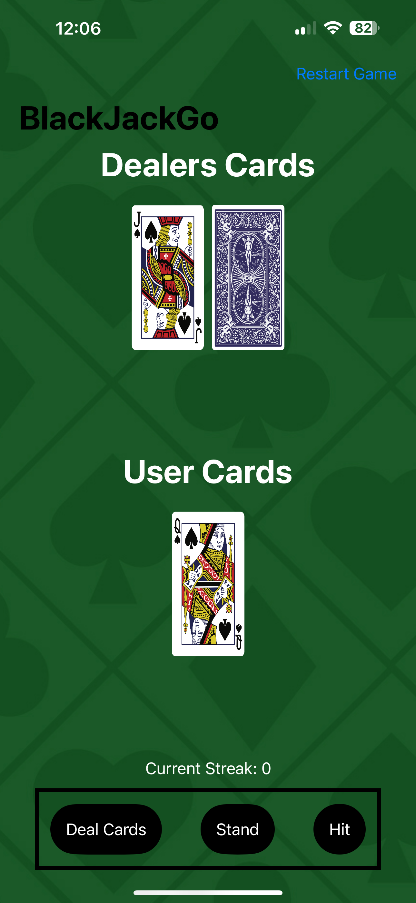

# Blackjackgame
This is a fun game using SwiftUI where the user is able to play an unlimited version of Blackjack without the risk of losing their money!

This was one of my first personal projects in Swift. This project uses core concepts such as different Views, using guards, and Array Indexing. All of these concepts come together to make a very fun to play game and the code can be found in ContentView.Swift . Below are pictures of what the game looks like in action.

## Demo
Here is what the overall game looks like:
The game as a sleek design with very user friendly buttons on the top and bottom of the game

After the user presses stand/hits blackjack the game notifies the user that they have won using the alert feature of SwiftUI as shown below

When a user hits and their cards total over 21 the game notifies the user that they lost using alerts as shown in this image 

