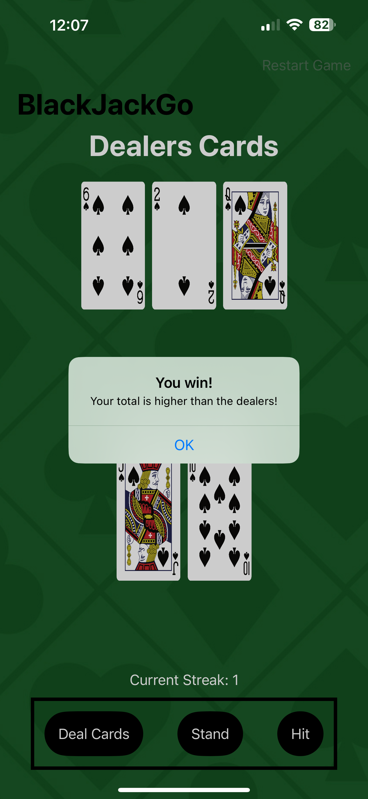
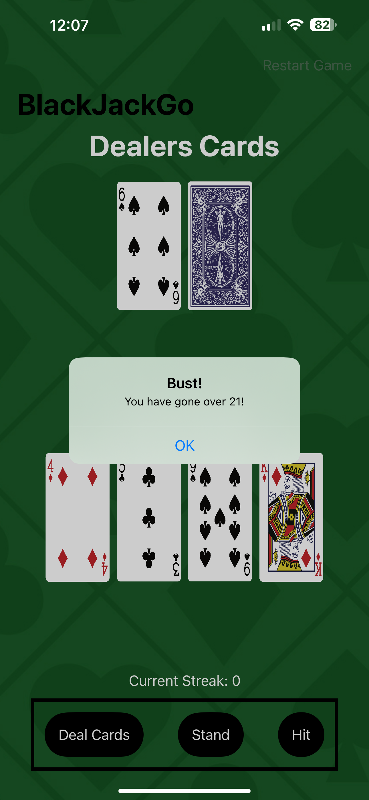

# Blackjackgame
This is a fun game using SwiftUI where the user is able to play an unlimited version of Blackjack without the risk of losing their money!

This was one of my first personal projects in Swift. This project uses core concepts such as different Views, using guards, and Array Indexing. All of these concepts come together to make a very fun to play game. Below is a picture of what the game looks like in action.

## Demo
Here is what the overall game looks like

 

Here is the user winning

 

And here is what happens when the user busts

 
